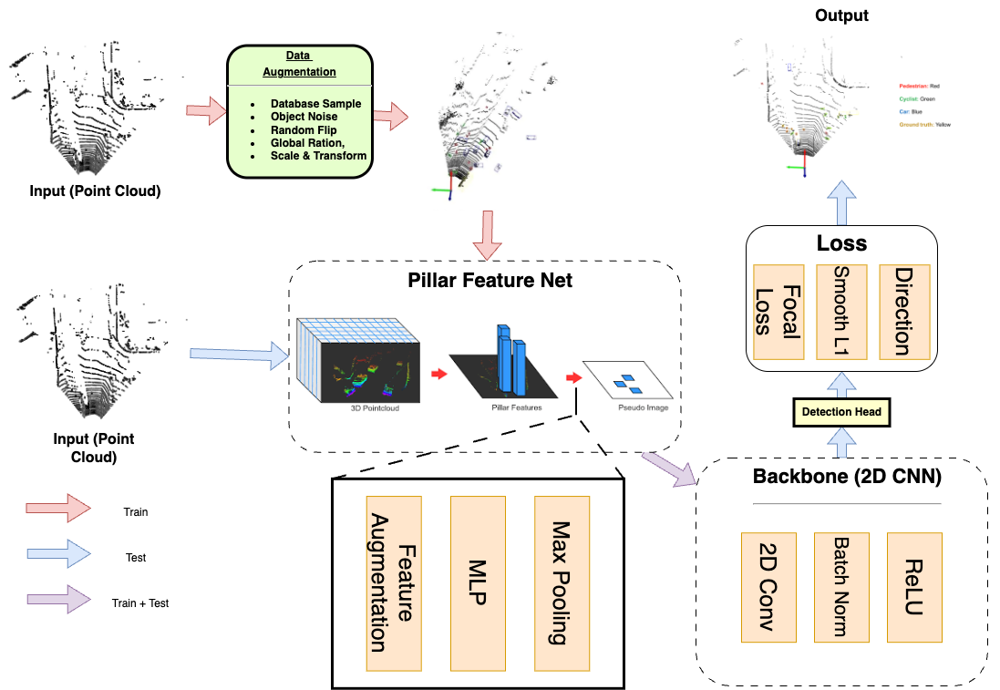

# LiDAR-Based 3D Object Detection with PointPillars

### Real-Time Environmental Awareness for the Visually Impaired

This project presents a LiDAR-based 3D object detection system designed to assist visually impaired individuals in real-time navigation. By leveraging the **PointPillars** architecture, we built a fast and efficient detection model that converts LiDAR point clouds into 3D bounding boxes. The system integrates **audio feedback**, enabling users to receive spoken descriptions of nearby obstacles, including distance, direction, and object class.

---

## 📷 Sample Outputs

🎥 [Click here to view the demo video](https://drive.google.com/file/d/1kJScnVlS8XourOvelULTHqV6_wJT1BV7/view?usp=sharing)

---

## 🚀 Features

- Real-time 3D object detection using PointPillars
- Trained on **KITTI**, fine-tuned on **Lyft (converted to KITTI format)**
- Optimized for **mobility applications on iOS** with LiDAR (e.g., iPhone Pro series)
- Integrated **gTTS-based audio feedback** for enhanced accessibility
- Evaluation includes 2D, BEV, and 3D metrics with orientation accuracy (AOS)

---

## Pipeline Overview

<div align="center">
  
  <p><em>PointPillars data flow from input to output</em></p>
</div>

---

## 🛠 Setup

### Installation
```bash
git clone https://github.com/s8aH/DeepLiDAR-VisionAssist.git
cd DeepLiDAR-VisionAssist
pip install -r requirements.txt
python setup.py build_ext --inplace
pip install .
```

---

## 📦 Datasets
- **KITTI**: [Link](https://www.cvlibs.net/datasets/kitti/)
- **Lyft (nuScenes format)**: [Kaggle](https://www.kaggle.com/competitions/3d-object-detection-for-autonomous-vehicles)

### 🔄 Convert Lyft Dataset to KITTI Format

Make the script executable (if needed):
```bash
chmod +x convert_lyft_to_kitti.sh
```
To convert the Lyft dataset into KITTI format for training and fine-tuning:
```bash
./convert_lyft_to_kitti.sh
```

To map Lyft dataset classes to KITTI-style classes, run:
```bash
python pointpillars/dataset/map_kitti_classes.py
```

> This will convert Lyft's original labels into KITTI's format using the following mapping:
```
car, truck, bus → Car  
bicycle, motorcycle → Cyclist  
pedestrian → Pedestrian
```

---

## 📈 Training & Fine-Tuning

### Training on KITTI:
```bash
python train.py --data_root your_path_to_kitti
```

### Fine-tuning:
```bash
python train.py \
    --data_root <DATASET_DIR> \
    --saved_path <OUTPUT_DIR> \
    --pretrained_weights <PRETRAINED_MODEL_PATH> \
    --batch_size <BATCH_SIZE> \
    --num_workers <NUM_WORKERS> \
    --init_lr <LEARNING_RATE> \
    --max_epoch <NUM_EPOCHS> \
    --ckpt_freq_epoch <CHECKPOINT_INTERVAL> \
    --log_freq <LOGGING_FREQUENCY>
```

### 📌 Argument Description

| Argument                  | Description                                                                 |
|---------------------------|-----------------------------------------------------------------------------|
| `<DATASET_DIR>`           | Path to dataset folder in KITTI format                                      |
| `<OUTPUT_DIR>`            | Where to save checkpoints and logs                                          |
| `<PRETRAINED_MODEL_PATH>` | Path to a pretrained `.pth` model (optional for fine-tuning)                |
| `<BATCH_SIZE>`            | Number of samples per training batch (e.g., 4 or 8)                          |
| `<NUM_WORKERS>`           | Number of parallel data loading workers (based on your CPU)                 |
| `<LEARNING_RATE>`         | Initial learning rate (e.g., 0.0001)                                         |
| `<NUM_EPOCHS>`            | Total number of training epochs (e.g., 100)                                  |
| `<CHECKPOINT_INTERVAL>`   | Save model checkpoint every N epochs (e.g., 10)                              |
| `<LOGGING_FREQUENCY>`     | Print logs every N steps (e.g., 4)                                           |

---

## 🎯 Evaluation

Evaluate Pretrained Model
```bash
python evaluate.py --ckpt path_to_your_model --data_root your_path_to_kitti 
```
Evaluate Fine-tuned Model
```bash
python evaluate.py --ckpt path_to_your_model --data_root your_path_to_kitti --finetune
```

Metrics:  
- **2D BBox**, **BEV**, **3D BBox**, and **AOS** (Average Orientation Similarity)  
- AP@0.5 for pedestrian/cyclist, AP@0.7 for cars

| Metric         | Gain from Fine-Tuning |
|----------------|------------------------|
| BEV BBox (Easy) | +0.12 AP |
| 3D BBox (Moderate) | +0.07 AP |
| AOS (Easy) | +0.05 AP |

---

## 🔊 Audio Feedback Module

Each detected object is translated into natural language via `gTTS`:
> “Pedestrian, 8.3 meters, right, 87% confidence”

```python
from audio_feedback import speak_detection
speak_detection(class_name="Car", distance=10.5, direction="left", confidence=0.91)
```

---

## 🧠 Future Work

- Add more diverse datasets for broader generalization
- Extend to additional object categories
- Explore domain adaptation or transfer learning
- Include object tracking and trajectory prediction

---

## 🙏 Acknowledgements

- This project builds on the [PointPillars implementation by zhulf0804](https://github.com/zhulf0804/PointPillars).
